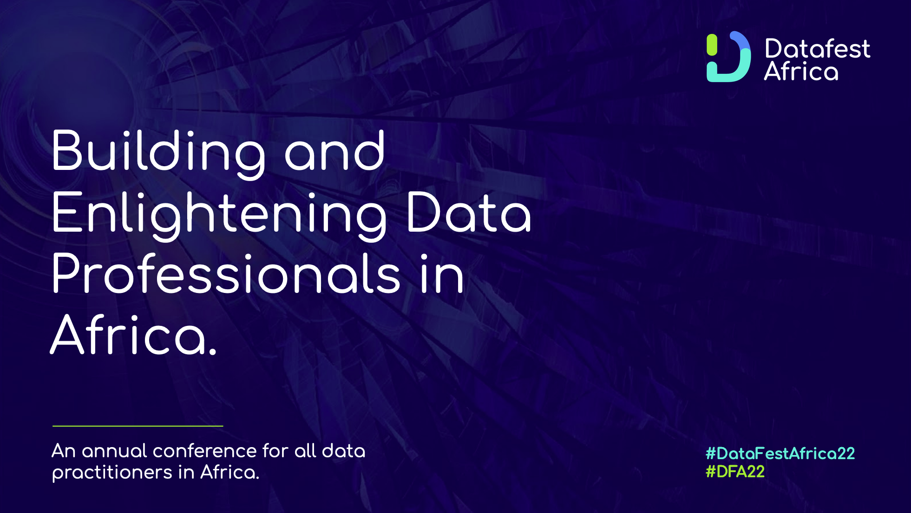

# DATAFEST22

## Containerization of Machine Learning Application
This workshop session will comprehensively create, deploy, and execute machine learning application containers using the Docker tool, demystify the various terms associated with containerization and shed light on the importance of this technology to the entire Machine learning workflow. This session will contain hands-on sessions covering building a machine learning model, building a machine learning application, containerizing the application with Docker, and deploying it to the cloud.

Kindly check the workshop prerequisite, read more [here](slides/Aboze%20Brain_Workshop%20Prerequisites.pdf)